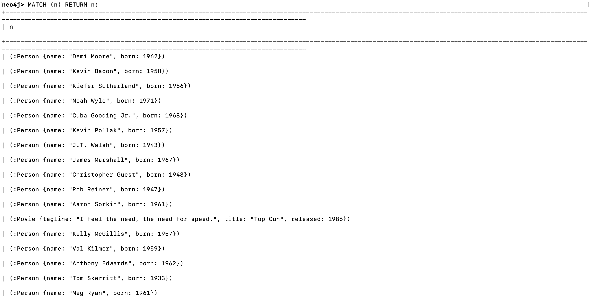
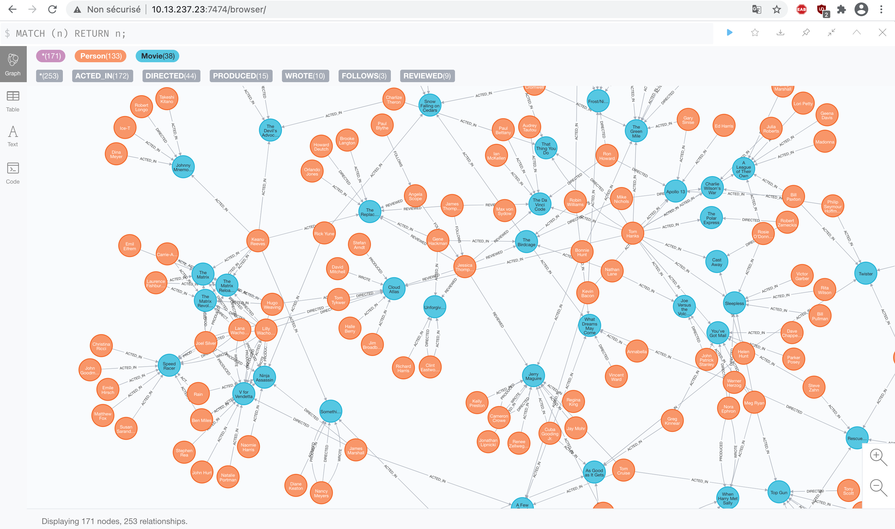
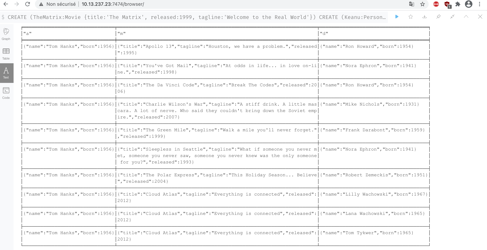
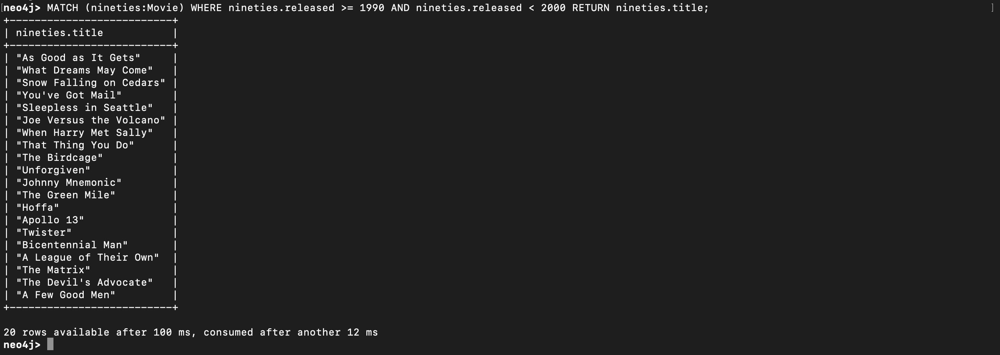
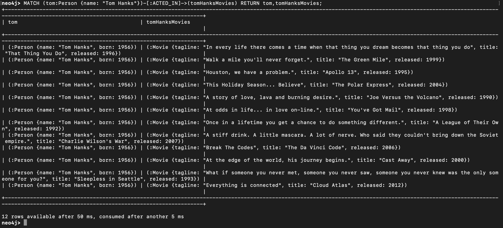
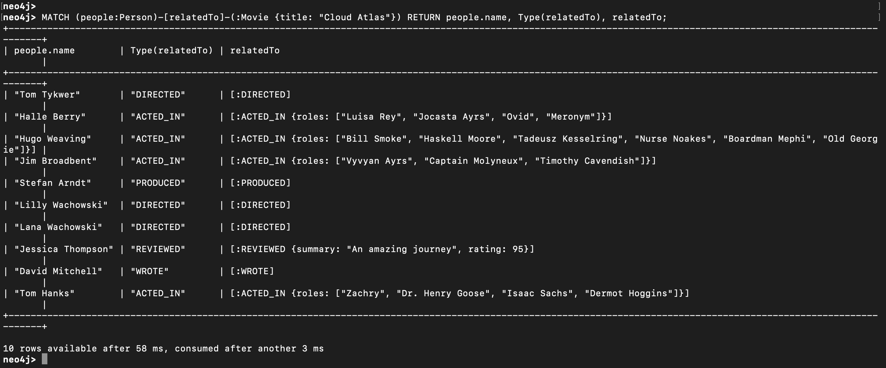

# NEO4J NOSQL GRAPH DATABASE :part_alternation_mark:
```
```

### :arrow_forward: Exécuter le fichier `docker-compose.yaml`

`docker-compose up --detach`

### :arrow_forward: exécuter le container neo4j

`docker exec -it neo4j bash`

### :arrow_forward: Éxécuter le CLI `cypher-shell` faisant partie du container `neo4j`

`cypher-shell -u neo4j -p <password>`

> lors de la première exécution le `username` et `mot de passe` par défaut est `neo4j `

```
```
:arrow_forward: :computer:

```
```


- [x] Lister les utilisateurs

`CALL dbms.security.listUsers()`

- [x]  Création d'un utilisateur

`CALL dbms.security.createUser(username, password, requirePasswordChange)`

- example 

`CALL dbms.security.createUser('zoureni', '1234', true)`
```
```
:arrow_forward: :computer:

```
```

- [x] Suppression d'un utilisateur

`CALL dbms.security.deleteUser('username')`

- example 

`CALL dbms.security.deleteUser('jane')`
```
```
:arrow_forward: :computer:

```
```

## Exemple de :part_alternation_mark: graph database de neo4j et quelque requête

### création d'une database movie :movie_camera:

- copier le contenu du fichier movie.graphql dans le CLI cypher-shell :diamonds:

- vous pouvez vérifier votre graphe dans le `CLI cypher-shell` en exécutant

   - `MATCH (n) RETURN n;`
   
   - 
   
```
```
- Avec le UI ça donne

   - 
```
```
   - 
```
```
   - 
```
```
-~~~~~~~~~~~~~~~~~~~~~~~~~~~~~~~~~~~~~~~~~~~~~~~~~~~~~~~~~~~~~~~~~~~~~~~~~~~~~~~~~~~~~~~~~~~~~~~~~~~~-

### Quelque requête :microscope: de notre base de donnée `Movie` :movie_camera:

- [x] :mag: Trouvez l'acteur nommé "Tom Hanks"

- `MATCH (tom {name: "Tom Hanks"}) RETURN tom;`

   > 

- [x] :mag: Trouvez le film avec le titre "Cloud Atlas"

- MATCH (cloudAtlas {title: "Cloud Atlas"}) RETURN cloudAtlas;
 
   > 

- [x] :mag: Trouver 10 personnes
 
- MATCH (people:Person) RETURN people.name LIMIT 10;
 
   > 

- [x] :mag: Trouvez des films sortis dans les années 1990

- MATCH (nineties:Movie) WHERE nineties.released >= 1990 AND nineties.released < 2000 RETURN nineties.title;
 
   > 

- [x] :page_with_curl: Liste tous les films de Tom Hanks 
 
- MATCH (tom:Person {name: "Tom Hanks"})-[:ACTED_IN]->(tomHanksMovies) RETURN tom,tomHanksMovies;
 
   > 

- [x] Qui a réalisé "Cloud Atlas"?:question:

- MATCH (cloudAtlas {title: "Cloud Atlas"})<-[:DIRECTED]-(directors) RETURN directors.name;

   >  
   
- [x] Comment les gens sont liés à "Cloud Atlas":question:

- MATCH (people:Person)-[relatedTo]-(:Movie {title: "Cloud Atlas"}) RETURN people.name, Type(relatedTo), relatedTo;

   >  

- [x] Les co-acteurs de Tom Hanks

- MATCH (tom:Person {name:"Tom Hanks"})-[:ACTED_IN]->(m)<-[:ACTED_IN]-(coActors) RETURN coActors.name;

   >  

